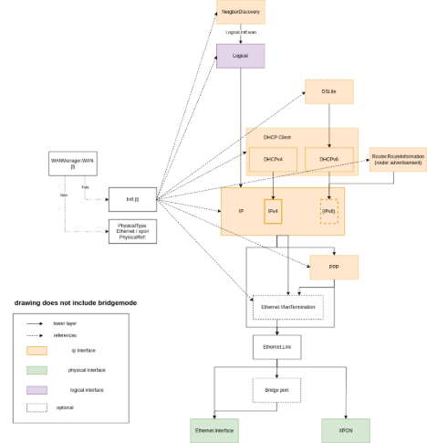
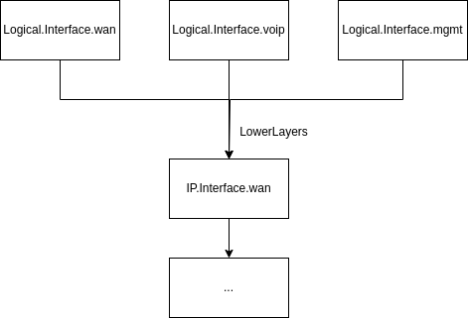
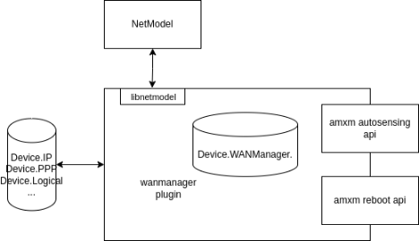
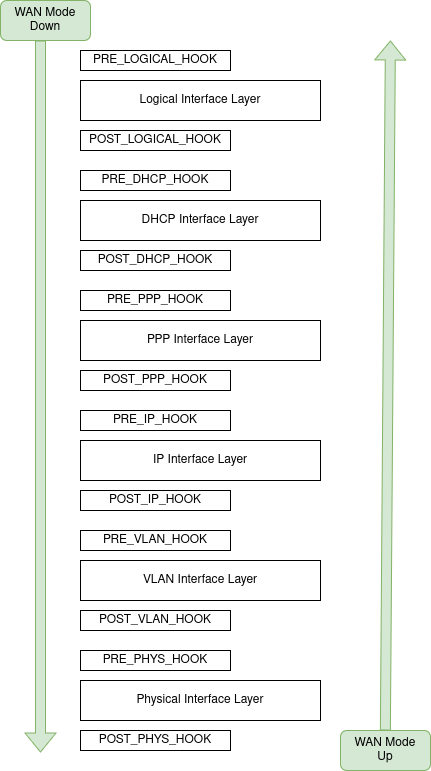

# **WAN Mode Manager Enhancements**
[Requirements](#wanmodemanagerenhancements-requirements) 

[Introduction and High-Level Description](#wanmodemanagerenhancements-introductionandhigh-leveldescription)

[Use Case Definition](#wanmodemanagerenhancements-usecasedefinition)

[References](#wanmodemanagerenhancements-references)

[Architecture](#wanmodemanagerenhancements-architecture) 

[Introduction](#wanmodemanagerenhancements-introduction) 

[Introduction: Multiple Active WAN Modes](#wanmodemanagerenhancements-introduction:multipleactivewanmodes)

[Introduction: AutoSensing](#wanmodemanagerenhancements-introduction:autosensing)

[Introduction: BBF Standardization](#wanmodemanagerenhancements-introduction:bbfstandardization)

[High Level Architecture Diagram](#wanmodemanagerenhancements-highlevelarchitecturediagram)

[Physical Interface Configuration](#wanmodemanagerenhancements-physicalinterfaceconfiguration) 

[Ethernet](#wanmodemanagerenhancements-ethernet) 

[PhysicalType == Ethernet](#wanmodemanagerenhancements-physicaltype==ethernet)

[PhysicalTypeRef approach](#wanmodemanagerenhancements-physicaltyperefapproach)

[GPON](#wanmodemanagerenhancements-gpon)

[Virtual Interface Configuration (Untagged/VLAN)](#wanmodemanagerenhancements-virtualinterfaceconfiguration\(untagged/vlan\)) 

[VLAN Configuration](#wanmodemanagerenhancements-vlanconfiguration)

[Untagged mode](#wanmodemanagerenhancements-untaggedmode)

[PPPoE Interface](#wanmodemanagerenhancements-pppoeinterface) 

[mode4 = ppp](#wanmodemanagerenhancements-mode4=ppp)

[mode6 = ppp](#wanmodemanagerenhancements-mode6=ppp)

[PPP credentials](#wanmodemanagerenhancements-pppcredentials)

[Static IP Configuration](#wanmodemanagerenhancements-staticipconfiguration)

[mode4 = static](#wanmodemanagerenhancements-mode4=static) 

[mode6 = static](#wanmodemanagerenhancements-mode6=static)

[IP Interface Configuration](#wanmodemanagerenhancements-ipinterfaceconfiguration) 

[IPv4/IPv6 link configuration](#wanmodemanagerenhancements-ipv4/ipv6linkconfiguration) 

[Setting of the mode:](#wanmodemanagerenhancements-settingofthemode:)

[Unsetting of the mode:](#wanmodemanagerenhancements-unsettingofthemode:)

[DHCP clients](#wanmodemanagerenhancements-dhcpclients)

[Other configuration](#wanmodemanagerenhancements-otherconfiguration)

[Implementation](#wanmodemanagerenhancements-implementation) 

[Modularity](#wanmodemanagerenhancements-modularity) 

[Proposal: extended modularity](#wanmodemanagerenhancements-proposal:extendedmodularity)

[Autosensing module](#wanmodemanagerenhancements-autosensingmodule)

[SoC-Vendor-specific Restart module](#wanmodemanagerenhancements-soc-vendor-specificrestartmodule)

[Terminology](#wanmodemanagerenhancements-terminology) 

[WAN Mode condition for status "up"](#wanmodemanagerenhancements-wanmodeconditionforstatus%22up%22)

[Current WAN Mode](#wanmodemanagerenhancements-currentwanmode)

[Theory of operation](#wanmodemanagerenhancements-theoryofoperation) 

[WANmanager setup of a WAN mode](#wanmodemanagerenhancements-wanmanagersetupofawanmode)

[WANmanager teardown of a WAN mode](#wanmodemanagerenhancements-wanmanagerteardownofawanmode)

[WANmanager Switching WAN mode: A → B](#wanmodemanagerenhancements-wanmanagerswitchingwanmode:a→b)

[Autosensing](#wanmodemanagerenhancements-autosensing) 

[data model](#wanmodemanagerenhancements-datamodel)

[implementation of mod-autosensing](#wanmodemanagerenhancements-implementationofmod-autosensing)

[Data Model](#wanmodemanagerenhancements-datamodel)

[Low-Level API](#wanmodemanagerenhancements-low-levelapi)

[API](#wanmodemanagerenhancements-api)

[Files](#wanmodemanagerenhancements-files)

[Firewall](#wanmodemanagerenhancements-firewall)

[Dependants and Dependencies](#wanmodemanagerenhancements-dependantsanddependencies) 

[Dependants](#wanmodemanagerenhancements-dependants)

[Dependencies](#wanmodemanagerenhancements-dependencies)

[Configuration](#wanmodemanagerenhancements-configuration) 

[Prerequisites](#wanmodemanagerenhancements-prerequisites)

[Multiple WAN Modes at the same time](#wanmodemanagerenhancements-multiplewanmodesatthesametime)

[runtime changes in WAN manager data model](#wanmodemanagerenhancements-runtimechangesinwanmanagerdatamodel)

[Backup/Restore, Upgrade, Reset](#wanmodemanagerenhancements-backup/restore,upgrade,reset)

[Web UI](#wanmodemanagerenhancements-webui)

[Considerations](#wanmodemanagerenhancements-considerations) 

[IPv6](#wanmodemanagerenhancements-ipv6)

[Packet Acceleration](#wanmodemanagerenhancements-packetacceleration)

[Memory Usage](#wanmodemanagerenhancements-memoryusage)

[Boot Time](#wanmodemanagerenhancements-boottime)

[Security](#wanmodemanagerenhancements-security)

[Remote Management](#wanmodemanagerenhancements-remotemanagement)

[Operational Monitoring](#wanmodemanagerenhancements-operationalmonitoring)

[Quality](#wanmodemanagerenhancements-quality) 

[Project Reference Configuration](#wanmodemanagerenhancements-projectreferenceconfiguration)

[Build-time Checks](#wanmodemanagerenhancements-build-timechecks)

[Run-time Checks](#wanmodemanagerenhancements-run-timechecks)

[Unit Tests](#wanmodemanagerenhancements-unittests)

[Logging and Debugging](#wanmodemanagerenhancements-logginganddebugging)

[Functional Tests](#wanmodemanagerenhancements-functionaltests)

[CI Tests](#wanmodemanagerenhancements-citests)

[Certification](#wanmodemanagerenhancements-certification)

[Design Review Documentation](#wanmodemanagerenhancements-designreviewdocumentation)
# <a name="wanmodemanagerenhancements-requirements"></a>**Requirements**
## <a name="wanmodemanagerenhancements-introductionandhigh-leveldescription"></a>**Introduction and High-Level Description**
Following are the limitations in the current WAN manager module.

- WAN manager MUST be SFP aware. WAN mode selection should include SFP type.
  - Depends on [SFP Transceiver Management](file:///C:/wiki/spaces/PWPWG/pages/388464648/SFP+Transceiver+Management)
- WAN Mode MUST be enhanced to do Interface auto-sensing based on the interfaces that have link status UP.
  - Already supported.
- WAN Mode MUST be enhanced to support the concept of WAN priorities in order to determine primary WAN and fall back based on priority.
  - Already supported.
- WAN manager MUST support vendor option to restart the gateway when there is a WAN mode change.
  - Restart: if required due to SoC limitations, typically the need to reboot in order to switch the packet accelerator WAN interface. Options:
    - WAN manager decides to reboot, based on a DM parameter.
    - LL API indicates the capabilities, or triggers the need to reboot on change of the Upstream interface.
- WAN manager MUST identify WAN mode mismatch during boot up of gateway.
  - A difference of configuration is detected, e.g. different SFP inserted, fibre cable connected whereas an Ethernet-connected ONT was present before.
  - If WANAutoSensing.Policy is set to Continuous, a change of hardware configuration will immediately lead to a switch to a higher sensing priority mode. AtBoot: only after a reboot. Sticky: only if it interrupts connectivity in the current WAN mode.
- WAN manager MUST enhance WAN mode reset functionality to release and renew DHCP and re-authenticate 802.1x.
  - On switch, WAN Manager must gracefully shut down the currently running protocols, from higher to lower layer (e.g. PPPoE terminate, DHCP release, VLAN removal, G-PON link termination).
  - As part of this graceful shutdown, [Device.IEEE8021x.](https://usp-data-models.broadband-forum.org/tr-181-2-17-0-usp.html#D.Device:2.Device.IEEE8021x.)Enable must be set to false.
  - Protocol shutdowns must wait for the appropriate object’s Status parameter to change to false, with a timeout to compensate for software or protocol failure status.
  - **Note**: 802.1x is not yet supported in prplOS
- WAN manager MUST support notification of WAN mode change to northbound systems.
  - An event subscription will not reach a remote Controller, as it will fire before the connection to the remote management system.
  - The appropriate parameter (presumably WANModeManager.WANMode) can be added to [Device.LocalAgent.Controller.BootParameter.](https://usp-data-models.broadband-forum.org/tr-181-2-17-0-usp.html#D.Device:2.Device.LocalAgent.Controller.BootParameter.) The Boot! event will be issued only after first connection to a remote Controller after boot.
- WAN Mode MUST be enhanced to support keeping more than one WAN interface link up.
  - All layers of the secondary WAN mode must be up, up to IP, for all virtual network interfaces as part of the WAN mode.
  - How do we detect failure of the primary mode?
    - Beyond routing table changes, also the remote management agent must be reconfigured, possibly the firewall, possibly IPTV/VoIP services, possibly the upstream DNS/NTP servers.
  - Any number of WAN modes must be supported in parallel.
    - Restricted to one WAN mode up per physical interface. E.g. PPP and DHCP WAN mode up on the same GPON interface in parallel is not supported, but a WAN mode on G-PON and one on Cellular is supported.
    - DM modelling: e.g. WANAutoSensing.WANMode.{i}.KeepUp=true → WAN Mode will not be shut down if another WAN mode with a higher priority is made active.
- WAN Mode MUST be enhanced in such a way that it does NOT limit the possibility of policy based routing of traffic over tunnelled interfaces
  - IPv6/IPv4 transition mechanisms must be covered, so MAP-T should work as dual-stack does.
    - DS-Lite is currently supported, explicitly in WAN Mode Manager. (In violation of the CE Router RFC). → **to be addressed**
    - MAP-T is in the backlog, probably for 2025.
  - Tunnels are outside the responsibility of the WAN Mode Manager, but dependencies need to be elaborated:
    - Tunnel management components are responsible for setting up a tunnel (e.g. GRE) to a particular endpoint.
    - The tunnel management component can is responsible for setting and maintaining any routing table entries to route traffic through a tunnel interface, in the default routing table, or in a custom routing table for policy-based routing.
    - When the tunnel is shut down, the tunnel management component is responsible to ensure that any routes are removed.
    - In case of the default routing table, a metric can be set, so routing could fall back to the default interface in case Linux detects that the tunnel is down.
    - The latter does not work for a stateless tunnel. The tunnel management component has the responsibility to check the state of the tunnel through other mechanism (heartbeat, …)
    - The tunnel management component should also subscribe to events indicating the state of the WAN interface (presumably via a logical interface), so it can bring up the tunnel when the WAN is up, and shut it down when the WAN is down.
      - **Note**: WAN Mode Manager does not yet support clean shutdowns, e.g. hold off until VoIP call is completed, remote management connection is shut down etc.
    - Open question: should the [Routing manager](file:///C:/wiki/spaces/PRPLWRT/pages/17596939/Routing+manager) be used to set routing tables? → feedback provided; document is to be updated to reflect reality.
    - Open question: [Routing manager](file:///C:/wiki/spaces/PRPLWRT/pages/17596939/Routing+manager) appears to not support custom routing tables. → to be added if not present


## <a name="wanmodemanagerenhancements-usecasedefinition"></a>**Use Case Definition[](https://prplfoundationcloud.atlassian.net/issues/?jql=key%20%3D%20%22PCF-1132%22%20ORDER%20BY%20type%2C%20created%20DESC)**
<https://prplfoundationcloud.atlassian.net/issues/?jql=key%20%3D%20%22PCF-1132%22%20ORDER%20BY%20type%2C%20created%20DESC> 
## <a name="wanmodemanagerenhancements-references"></a>**References**

[PCF-1132](https://prplfoundationcloud.atlassian.net/browse/PCF-1132) - Getting issue details... STATUS 

<https://issues.broadband-forum.org/browse/DEV2DM-1000>
# <a name="wanmodemanagerenhancements-architecture"></a>**Architecture**
Note: the network interface is detected based on the PhysicalInterface parameter and a true value of the Upstream DM parameter. Currently, only Ethernet is supported.

The *scan* priority is determined by the WANAutoSensing.Candidates parameter, and indicates the sequence of candidates to try.

There is currently no implementation of a *preference* priority, i.e. a switch to a mode with a higher preference when that comes up.

- WAN Mode MUST be enhanced to do Interface auto-sensing based on the interfaces that have link status UP. → Though not described in the documentation, this is already verified (netdev interface LOWER\_UP) by the current auto-sensing logic.
## <a name="wanmodemanagerenhancements-introduction"></a>**Introduction**
The WANManager is a Ambiorix service, which handles the configuration of different WAN Types. A typical HGW configuration must be capable of handling different types of WAN Access mechanisms. Although TR-181 is capable of providing data model for each configuration, it is a cumbersome to apply the WAN mode in one atomic operation and to configure the complete network hierarchy efficiently.

Therefore the WANManager is introduced. The component is, at the moment of writing not standardized in BBF, but effort is ongoing.

When defining a standard data model, care is taken to avoid configuration duplication, so where possible the configuration of Parameter value are stored in a TR-181 compliant Network Interface instance, rather than duplicating data between WANManager and other microservices.

Therefor the WANManager data model extensively used Reference Parameters in its data model.
### <a name="wanmodemanagerenhancements-introduction:multipleactivewanmodes"></a>**Introduction: Multiple Active WAN Modes**
Multiple Active WAN Modes are required for two main use cases

- Bonding Interfaces (Future Use case)
- Failover Interface Use Case: It must be possible to assign a primary and secondary WAN Interface, which can be up at the same time.
  - It must be possible to make an distinction between the primary and secondary WAN modes in the data model.
  - The existing API functions also need to extended to deal with multiple active WAN modes. (setWANMode(), addWANMode(), DeleteWANMode())
  - The Data model must be extended to be more flexible. (Including BBF discussions for standardization)
### <a name="wanmodemanagerenhancements-introduction:autosensing"></a>**Introduction: AutoSensing**
Auto sensing is implemented as a separate module, to allow customers to fully customize the behavior. prpl will provide an example module, document it and document the API between Module and Plugin.

- Autosensing will be extended with data model Parameters to be able to set a (Sensing)Priority.
- Autosensing must be able to work in combination with Multiple Active WAN modes.
### <a name="wanmodemanagerenhancements-introduction:bbfstandardization"></a>**Introduction: BBF Standardization**
In order to provide a TR-181 compliant Data model, there is, at the moment of writing, an attempt to standardize the WANManager data model. (<https://issues.broadband-forum.org/browse/DEV2DM-1000>). Data model changes are expected to happen, and also backwards compatibility will not always be guaranteed.

- One of main changes we expect is to introduce InterfaceReference parameters rather than implicit logic to detect TR-181 Interfaces. (Example, Instead of using an PhysicalType=”ethernet”, parameter, a PhysicalTypeRef=”Device.Ethernet.Interface.i.” will be introduced.
## <a name="wanmodemanagerenhancements-highlevelarchitecturediagram"></a>**High Level Architecture Diagram**
The WANManager must reflect the following levels of configuration: physical interfaces, virtual interfaces, ip, logical


 
## <a name="wanmodemanagerenhancements-physicalinterfaceconfiguration"></a>**Physical Interface Configuration**
The first level of configuration is the physical Interface configuration of the WAN. This setting depends on the hardware capabilities of board. The WANManager will use Netmodel to detect the status and the availability of physical interfaces.

All detection is done asynchronously, NetModel Queries are heavily used for this purpose.

[to obsolete] A Dedicated WAN mode parameter "PhysicalType" is used for this: WANManager.WAN.1.PhysicalType="Ethernet",

[since revision 2] obsoleted by PhysicalTypeRef parameter

Physical types to support:

- ethernet:
- Gpon:
- Cellular Interface

[since revision 2] PhysicalTypeRef parameter is a Device reference parameter to refer to the (existing) Physical Interface Path.

- For backwards compatibility, the PhysicalType Parameter should still be supported, but when the PhysicalTypeRef is filled in, the latter has to take precedence.
### <a name="wanmodemanagerenhancements-ethernet"></a>**Ethernet**
#### <a name="wanmodemanagerenhancements-physicaltype==ethernet"></a>**PhysicalType == Ethernet**
In TR181, The use of the 'Upstream' parameter is used to indicate an interface is upstream facing. The 'Upstream' parameter is translated in a NetModel 'upstream' flag which can be used to query interfaces.

Use a Query: getIntf(Device.Ethernet.Link.1. (or "lo"), flags="upstream && eth\_Intf", traverse="all") to find the correct upstream Ethernet interface (TR181 interface path/linux interface)
```
NetModel.Intf.ethIntf-ETH0. > getIntfs(flag = "eth\_intf && upstream", traverse = all)

[

  [

    "ethIntf-ETH0"

  ]

]
```
The upstream interface is the Interface in the Ethernet Interface table where Upstream = true.
#### <a name="wanmodemanagerenhancements-physicaltyperefapproach"></a>**PhysicalTypeRef approach**
In case the PhysicalTypeRef parameter is configured “Device.Ethernet.Interface.1” This parameter takes precedence over the PhysicalType parameter and will be selected as Physical WAN Interface.
### <a name="wanmodemanagerenhancements-gpon"></a>**GPON**
The Same way upstream Ethernet interfaces are detected, the GPON upstream interface must be detected, only the flags in the Netmodel query might change. As an Alternative to PhysicalType=Gpon, it is also possible to define the PhysicalRefType= “Device.GPon.(…) “ interface reference.
## <a name="wanmodemanagerenhancements-virtualinterfaceconfiguration(untagged/vlan)"></a>**Virtual Interface Configuration  (Untagged/VLAN)**
### <a name="wanmodemanagerenhancements-vlanconfiguration"></a>**VLAN Configuration**
Per WANMode we can define a number of interfaces, each interface has a Type parameter. When set to "vlan", the Intf must be considered as a VLAN Interface and the VlanID and VlanPriority fields needs to be taken into account.

A VLAN Configuration can be applied on all Ethernet.Link interfaces (Eth/MoCA/ATM/PTM/...)

Question: How does the WANManager know which VLANTermination interface to link?

- Based on the PhysicalType, a lowerlayer interface will be selected
  - Device.Ethernet.Interface.i.
  - Device.MoCA.Interface.i.
- Then WANManager search for a VLANTermination instance installed with a matching VLANID
  - (using NetModel): NetModel.Intf.*ethIntf-ETH0*.getIntfs(flag = vlan, traverse = up)
- Check the results for a VLANTermination with a matching VLAN ID.
- If it does not exists, create it, else enable it
  - Make sure the VlanPriority value is correctly applied.

If no vlanTermination instance is found based on the mechanisms defined higher up, a new instance must be created and linked with the correct Ethernet.Link. instance

If multiple interfaces with the same VLANID are defined, the behaviour is undefined.
### <a name="wanmodemanagerenhancements-untaggedmode"></a>**Untagged mode**
If the Intf Type parameter is set to "untagged" the Physical interface will be used as if.

- for Ethernet: The IP Interface needs to be linked with Ethernet.Link.<wan\_ethernet\_link>

(The Interfaces should be preconfigured on a board, and the config needs to correspond with the hardware board layout.)
## <a name="wanmodemanagerenhancements-pppoeinterface"></a>**PPPoE Interface**
A ppp instance must be linked with the IP.Interface. reference if mode4=ppp or mode6=ppp  (or both)

Having ppp configured adds another layer in the Interface stack (between the Ethernet.Link (untagged)/VLANTermination(VLANTagged) and the IP Interface).

*Today only one PPP Interface is supported, that Interface is taken by WANManager.*

*As a Future extension, it should be possible to define multiple PPP Interface, and select the correct DM instance using a PPPInterfaceRef parameter.*
#### <a name="wanmodemanagerenhancements-mode4=ppp"></a>**mode4 = ppp**
→ Make sure to disable (and unlink) any DHCPv4 client which has a lowerlayer set to the IP Interface reference

→ enable ppp(ipcp) and set LowerLayer correcty to the Interface Reference
#### <a name="wanmodemanagerenhancements-mode6=ppp"></a>**mode6 = ppp**
→Do not touch the dhcpv4 client Configuration

→ Make sure to disable any DHCPv6 client which has a lowerlayer set to the IP Interface reference

→ enable ppp(ip6cp) and set LowerLayer correctly to the Interface Reference
### <a name="wanmodemanagerenhancements-pppcredentials"></a>**PPP credentials**
In case a wan mode is setting up PPP, the PPP username and/or password of that wan-mode is copied over to the PPP plugin (when filled in).

Changing credentials in an active wanmode with PPP does not take these changes into account is needed to call the WANManager.Reset() RPC function to use these new credentials.
## <a name="wanmodemanagerenhancements-staticipconfiguration"></a>**Static IP Configuration**
## <a name="wanmodemanagerenhancements-mode4=static"></a>**mode4 = static**
A Static IPv4 address must be configured.

→ a default ipv4 address, netmask and default router must be provided in a separate "IPv4Address." subobject.

- IPv4Address.IPAddress
- IPv4Address.SubnetMask
- IPv4Address.DefaultRouter
- IPv4Address.DNSServers /\* comma separated list of (ipv4) DNS Servers. \*/

→ This information will be copied in the correct IPv4Address Instance of the linked IP. Interface instance.
#### <a name="wanmodemanagerenhancements-mode6=static"></a>**mode6 = static**
→ a default ipv6 address, netmask and default router must be provided in a separate "IPv6Address." subobject.

- IPv6Address.IPAddress
- IPv6Address.SubnetMask
- IPv6Address.DefaultRouter
- IPv6Address.DNSServers /\* comma separated list of (ipv6) DNS Servers. \*/

→ This information will be copied in the correct IPv6Address Instance of the linked IP. Interface instance.
## <a name="wanmodemanagerenhancements-ipinterfaceconfiguration"></a>**IP Interface Configuration**
Each WANMode Interface needs to have at least one link to an “Device.IP.Interface.i instance reference”

example:

WANManager.WAN.3.Intf.1.IPv4Mode="ppp4"
WANManager.WAN.3.Intf.1.IPv4Reference="Device.IP.Interface.2."
WANManager.WAN.3.Intf.1.IPv6AddressDelegate=""
WANManager.WAN.3.Intf.1.IPv6Mode="dhcp6"
WANManager.WAN.3.Intf.1.IPv6Reference="Device.IP.Interface.6."

These Instances must exists in the Data model. It is not possible to create these interface automatically (The reason is that the IP Interface instances contain a lot of parameters which should be correctly set before they make sense)
### <a name="wanmodemanagerenhancements-ipv4/ipv6linkconfiguration"></a>**IPv4/IPv6 link configuration**
It is possible that individual connectivity is not needed on all of the (logical) WAN interfaces instead set one or more interfaces in the "link" IPMode. For example voip and mgmt can use the same IP interface as the wan interface.

 
#### <a name="wanmodemanagerenhancements-settingofthemode:"></a>**Setting of the mode:**
→ IPv4/IPv6 Link mode

- Logic:
  - Adds the IPv4Reference / IPv6Reference to the LowerLayers parameter of the corresponding logical interface.
#### <a name="wanmodemanagerenhancements-unsettingofthemode:"></a>**Unsetting of the mode:**
→ IPv4/IPv6 Link mode

- Logic:
  - Removes the IPv4Reference / IPv6Reference from the LowerLayers parameter of the corresponding logical interface.
### <a name="wanmodemanagerenhancements-dhcpclients"></a>**DHCP clients**
The DHCPv4 and DHCPv6 interfaces are not modeled as a lower layer of an IP Instance but are linked with an IP Interface instance (Via "DHCPv4.Client.x.Interface")

In case we have a WAN mode, with Mode4|6 = dhcp, an existing DHCP client needs to be linked with the IP.Interface instance or we need to create a new DHCPv4|6 instance
## <a name="wanmodemanagerenhancements-otherconfiguration"></a>**Other configuration**
To be done

- Default route
- DNS
- IPv4, IPv6 specificities
# <a name="wanmodemanagerenhancements-implementation"></a>**Implementation**
## <a name="wanmodemanagerenhancements-modularity"></a>**Modularity**
The wanmanager plugin uses Separation of Concerns to allow different behaviors. Amxm modules are loaded only at start of the wan manager plugin, meaning after the initial loading to add a module the wan manager should be restarted.

There are the following parameters:

- WANManager.SupportedControllers → used for validating Controllers
- WANManager.Controller → used to load amxm module autosensing, should we change this to csv\_string to load reboot module and others?

 
### <a name="wanmodemanagerenhancements-proposal:extendedmodularity"></a>**Proposal: extended modularity**
 
### <a name="wanmodemanagerenhancements-autosensingmodule"></a>**Autosensing module**
The wan manager controls setup and teardown of the WAN Modes but it is the logic in the autosensing module that selects the WAN Modes to enable. See autosensing later.

Only WAN Modes with EnableSensing=true are known to autosensing.

The autosensing module is started by wanmanager when (1) OperationMode is "Automatic" and (2) it got the physical layer via its Netmodel query.

WAN manager stops the autosensing module when (1) a WAN Mode reaches status "up" (only for ipv4, for ipv6 autosensing is not stopped) or (2) OperationMode is no longer "Automatic".

WAN Manager Hooks:

- lower layer physical interface Netmodel query starts and stops autosensing
- status "up" causes wan manager to stop autosensing
- autosensing module may cause wan manager to switch WAN mode
### <a name="wanmodemanagerenhancements-soc-vendor-specificrestartmodule"></a>**SoC-Vendor-specific Restart module**
Hardware acceleration drivers may require extra steps after switching WAN modes, e.g. some may require calling a script or rebooting the HGW.

WAN Manager Hooks:

- *to be defined (AT&T contributes this module for prpl)*
## <a name="wanmodemanagerenhancements-terminology"></a>**Terminology**
### **WAN Mode condition for status "up"**
The Netmodel IsUp query on interface "IPv4Reference" and "IPv6Reference" with flag "ipv4-up" and respectively "ipv6-up" are used to determine if a WAN Mode is status "up".
### <a name="wanmodemanagerenhancements-currentwanmode"></a>**Current WAN Mode**
This is parameter WANManager.WANMode.

[since revision 2] How will this be modeled when multiple WAN modes are up/enabled?
## <a name="wanmodemanagerenhancements-theoryofoperation"></a>**Theory of operation**
### <a name="wanmodemanagerenhancements-wanmanagersetupofawanmode"></a>**WANmanager setup of a WAN mode**
Conditions to setup a WAN Mode:

- WANManager.WANMode changes
- WANManager.Reset()
- WANManager.setWANMode()
- autosensing

Setup is a layered approach:

1. First the Physical WAN mode needs to be detected
1. Then we must set up all low level interfaces (untagged/vlan tagged)
1. Then we need to set up the IP.Interfaces (Lowerlayers, Enable,...)
1. Then the logicalInterfaces needs to be configured.
1. Then we need to set up ipv4 and ipv6 mode (ppp/dhcp)
### <a name="wanmodemanagerenhancements-wanmanagerteardownofawanmode"></a>**WANmanager teardown of a WAN mode**
Conditions to teardown a WAN Mode:

- *todo document conditions to teardown a WAN mode*

Teardown is a layered approach of the WAN Mode A to prevent ipv4 knocking down the lower layers of ipv6:

- Bring down LogicalInterfaces
- Bring down DHCP/PPP
- Bring down IP Interfaces
- Bring down vlans
- Bring down (eventually) physical Interfaces
### <a name="wanmodemanagerenhancements-wanmanagerswitchingwanmode:a→b"></a>**WANmanager Switching WAN mode: A → B**
1. Teardown WAN mode A → see "WANmanager teardown of a WAN mode"
1. Setup WAN mode B → see "WANmanager setup of a WAN mode"
## <a name="wanmodemanagerenhancements-autosensing"></a>**Autosensing**
[since revision 2] To cope with multiple WAN Modes sensing the module can enable multiple WAN Modes at the same time for the wanmanager to setup but only 1 WAN Mode per physical type may be sensed at the same time. For WAN Modes of the same physical type the autosensing module may use the Priority parameter (instead of the data model index). There is no longer a single "current WAN Mode", api's between wanmanager and autosensing module have to be able to handle this. The wanmanager should not stop autosensing when 1 WAN Mode is up.
### <a name="wanmodemanagerenhancements-datamodel"></a>***data model***
The following data model exist for autosensing:

WANManager.SensingPolicy → supported values: AtBoot, Continuous, [since revision 2] Sticky

WANManager.SensingTimeout

WANManager.OperationMode

WANManager.WAN.{i}.EnableSensing

[since revision 2] WANManager.WAN.{i}.Priority
### <a name="wanmodemanagerenhancements-implementationofmod-autosensing"></a>**implementation of mod-autosensing**
This autosensing module will start a timer, hereafter known as the sensing timer, during which a WAN Mode has time to reach status "up".

WAN Modes are iterated in order of their data model index.

When autosensing is ongoing:

- (at start of autosensing:) if "current WAN Mode" has EnableSensing then the first WAN Mode to be sensed is this WAN Mode (which may or may not have data model index 0), otherwise see "retry:".
- (retry:) autosensing module will select the "next WAN Mode". If at end of the WAN Mode list; if mode "Continues" then retry the first WAN Mode, else stop sensing.
- autosensing module will tell the wanmanager to  update the "current WAN Mode" to autosensing's "next WAN Mode". The wanmanager will disable the "current WAN Mode" and enable the "next WAN Mode".
- autosensing module will rearm its sensing timer and wait for (1) sensing timer expire or (2) wanmanager stops autosensing (see modularity chapter for its reasons).
- if sensing timer has expired then autosensing module will tell wanmanager to close all netmodel queries of the "current WAN Mode" (parameter WANManager.WANMode) for each WANManager.WAN.{i}.Intf.\*intf\_name and clear netmodel flag logical4-up / logical6-up. Autosensing module will go to step "retry:".
## **Data Model**
- Add reboot reason: reboot triggered by WAN mode change.
- Extend BBF DM. Reintroduce Name parameter, Priority. 24 Apr 2024 Was the Name parameter name changed to “LogicalInterface”?

|**Name**|**Type**|**W/P/V**|**Description**|**Legal Values/Default**|**Action on Add/Del/Modify**|**Version**|
| :-: | :-: | :-: | :-: | :-: | :-: | :-: |
|**WANManager**|**Object**|**RP**||**–**||**1.0**|
|SupportedControllers|csv\_string|R|Only modules that are added to this comma separated list can be configured in the Controller parameters. The name used should be the name of the so file without the extension.|default: mod-autosensing|–|1\.0|
|Controller|string|RWP|Configures the module that should be used for autosensing. Can only be one of the supported controllers configured in SupportedControllers|default: mod-autosensing|–|1\.0|
|ApplyAtNextBoot|bool|RWP|When this parameter is set to true, the wan mode will be applied at boot. After applying the config, this parameter will be set to false.|default: true|–|1\.0|
|setWANMode()|function|–|*bool* setWANMode(*in string* WANMode, *in string* Autosensing)<br>Set WAN mode<br>WANMode: - value to which to change WANMode<br>Autosensing: - Change requested by WANAutosensing<br>returns: - true on success|–|–|1\.0|
|setIPv4Mode()|function|–|*bool* setIPv4Mode(*in string* IPv4Mode, *in string* InterfaceAlias)<br>Set IPv4 mode for the given interface in the current WANMode<br>IPv4Mode: <br>InterfaceAlias: - Alias of the wan mode interface to act on<br>returns: - true on success|–|–|1\.0|
|setIPv6Mode()|function|–|*bool* setIPv6Mode(*in string* IPv6Mode, *in string* InterfaceAlias)<br>Set IPv6 mode for the given interface in the current WANMode<br>IPv6Mode: <br>InterfaceAlia: - Alias of the wan mode interface to act on<br>returns: - true on success|–|–|1\.0|
|Reset()|function|–|*void* Reset()<br>On a reset the current WANMode MUST be teared down and established again<br>returns:|–|–|1\.0|
|getCurrentWANModeStatus()|function|–|*bool* getCurrentWANModeStatus()<br>Get status of current WAN mode. Use by WANAutosensing<br>returns: - true when WANMode status is Enabled and configured interface obtain IP address|–|–|1\.0|
|getWANMode()|function|–|*string* getWANMode()<br>Get WAN mode<br>returns: - complete map with the whole configuration|–|–|1\.0|
|WANMode|string|RWP|Mode to which WAN interface is configured to|default:|–|1\.0|
|OperationMode|string|RWP|WANMode sensing operational mode. OperationMode = Manual: The WANMode will be set fixed. OperationMode = Automatic: The WANMode will be selected based on a WAN Autosensing mechanisme.|default: Manual|–|1\.0|
|SensingPolicy|string|RWP|WANMode sensing Policy: Defines how the autosensing mechanism should work. Different behavior can be applied Policy = AtBoot: WAN Sensing will be started at boot, once a WANMode is detected, it will be set 'fixed' Policy = Continuous: The WANMode selection procedure will be continuous looping over all applicable WANModes until we found a working WANMode.|default: AtBoot|–|1\.0|
|SensingTimeout|uint32|RWP|Defines the maximum time to wait to decide if a WANMode is active or not. Only one timeout is used for each WANMode.|default: 8|–|1\.0|
|**WANManager.WAN.i**|**Object**|**RWP**|**WAN mode definition**|**–**||**1.0**|
|Alias|string|RWP|A non-volatile unique key used to reference this instance (as defined in TR181)|default:|–|1\.0|
|PhysicalType|string|RWP|Physical interface type of the WAN mode.|default: Ethernet|–|1\.0|
|Origin|string|RWP|Indicates if the WANMode is considered owned by the: "system": Typically a predefined WANMode which is configured by an ISP for a specific network layout. "user": Typically a WANMode defined by a HGW user via a webui, or a configuration APP. By default we consider new WANModes owned by a "user".|default: user|–|1\.0|
|EnableSensing|bool|RWP|Indicates if the WANMode is applicable for WANAutoSensing or not.|default: true|–|1\.0|
|Status|string|R|Status parameter to indicate the WAN Mode is active, in error state or disabled|default: Disabled|–|1\.0|
|DNSMode|string|RWP|Parameter that define the way how to configure the DNS servers. Enumeration of: - Static - Dynamic|default: Dynamic|–|1\.0|
|IPv6DNSMode|string|RWP|Parameter that define the way how to configure the DNS servers. Enumeration of: - Static - Dynamic|default: Dynamic|–|1\.0|
|**WANManager.WAN.i.Intf.i**|**Object**|**RWP**|**WAN mode definition**|**–**||**1.0**|
|Alias|string|RWP|A non-volatile unique key used to reference this instance (as defined in TR181)|default:|–|1\.0|
|Name|string|RWP|The textual name of interface (one of wan, voip, mgmt, iptv)|default: wan|–|1\.0|
|UserName|string|RWP|<p>PPP User name Takes precedence over username filled in tr181-ppp plugin, except when it is empty.</p><p>The PPP Username is only copied to PPP data model when the WANMode is explicitly applied.</p>|default:|–|1\.0|
|Password|string|RWP|<p>PPP User password Takes precedence over password filled in tr181-ppp plugin, except when it is empty.</p><p>The PPP Passwordis only copied to PPP data model when the WANMode is explicitly applied.</p>|default:|–|1\.0|
|IPv4Mode|string|RWP|Interface IPv4 configured mode: - none: No IPv4 address at all on this interface - link: Instead of having your own IPv4 address, use the address set for the IPv4Reference interface.|default: dhcp4|–|1\.0|
|IPv6Mode|string|RWP|Interface IPv6 configured mode: - none: No IPv6 address at all on this interface - link: Instead of having your own IPv6 address, use the address set for the IPv6Reference interface.|default: none|–|1\.0|
|IPv4Reference|string|RWP|Mapped Lower layer interface for IPv4|default:|–|1\.0|
|DefaultRouteReference|string|RWP|Reference to an entry of Device.Routing.Router.i.IPv4Forwarding which should be used as the default route instance. If this value is non-empty, a default route for this interface will be created.|default:|–|1\.0|
|IPv6Reference|string|RWP|Mapped Lower layer interface for IPv6|default:|–|1\.0|
|Type|string|RWP|High level interface Type, one of "untagged", "vlan", "atm"|default: untagged|–|1\.0|
|VlanID|uint32|RWP|Vlan ID, number between 0 and 4096|default: 100|–|1\.0|
|VlanPriority|int32|RWP|Vlan priority, number between -1 and 7 -1 - priority not assigned|default: 0|–|1\.0|
|DeferredIPv6Instances|csv\_string|RWP|comma separated list of IP instances (typically lan interfaces) WAN-manager will manage the ParentPrefixes for the IPv6Prefixes in these interfaces|default:|–|1\.0|
|BridgeReference|string|RWP|Reference to the bridge, if filled in the bridge mode will be enabled|default:|–|1\.0|
|DHCPv4Reference|string|RWP|Reference to the DHCPv4 Client instance, required if IPv4Mode is set to dhcp|default:|–|1\.0|
|DHCPv6Reference|string|RWP|Reference to the DHCPv6 Client instance, required if IPv4Mode is set to dhcp|default:|–|1\.0|
|IPv6AddressDelegate|string|RWP|If set the wan-manager will threat this interface as unnumbered. Contains the Device path to the LAN interface where the IPv6 address should be taken from. Currently only used for PPP modes.|default:|–|1\.0|
|**WANManager.WAN.i.Intf.i.IPv4Address.i**|**Object**|**RWP**|**Static IPv4 network configuration Only applicable if Mode4 is set to static Only one instance is expected per wan\_mode**|**–**||**1.0**|
|Alias|string|RWP|A non-volatile unique key used to reference this instance (as defined in TR181)|default:|–|1\.0|
|IPv4Address|string|RWP|Static IPv4 Address|default:|–|1\.0|
|SubnetMask|string|RWP|Static IPv4 Subnetmask|default:|–|1\.0|
|DefaultRouter|string|RWP|Static IPv4 default router address|default:|–|1\.0|
|DNSServers|csv\_string|RWP|comma separated list of static IPv4 DNS Server addresses. at most 4 ipv4 addresses can be provided.|default:|–|1\.0|
|**WANManager.WAN.i.Intf.i.IPv6Address.i**|**Object**|**RWP**|**Static IPv6 network configuration Only applicable if Mode6 is set to static Only one instance is expected per wan\_mode**|**–**||**1.0**|
|Alias|string|RWP|A non-volatile unique key used to reference this instance (as defined in TR181)|default:|–|1\.0|
|IPv6Address|string|RWP|Static IPv6 Address|default:|–|1\.0|
|PrefixLength|uint32|RWP|Static IPv6 PrefixLength, typically a number between 0 and 128|default: 64|–|1\.0|
|DefaultRouter|string|RWP|Static IPv6 default router address|default:|–|1\.0|
|DNSServers|csv\_string|RWP|comma separated list of static IPv6 DNS Server addresses. at most 4 ipv6 addresses can be provided.|default:|–|1\.0|
## <a name="wanmodemanagerenhancements-low-levelapi"></a>**Low-Level API**
- LL API indicates the capabilities, or triggers the need to reboot on change of the Upstream interface. → <https://prplfoundationcloud.atlassian.net/wiki/spaces/LLAPI/pages/16384403/Hardware+Offload#WAN-Interface-Selection>
  - It must be possible to feed this into the reboot reasons [2024-03-12 Meeting Notes (Reboot Reasons, Firewall IPSec, Release Notes & TR-106)](file:///C:/wiki/spaces/HLAP/pages/447086843/2024-03-12+Meeting+Notes+Reboot+Reasons+Firewall+IPSec+Release+Notes+TR-106)
## <a name="wanmodemanagerenhancements-api"></a>**API**
## <a name="wanmodemanagerenhancements-files"></a>**Files**
".odl" files → /etc/amx/wan-manager/ 

wan-manager's amxrt entrypoint ".so" file →/usr/lib/amx/wan-manager/

init script → /etc/init.d/wan-manager

acl files → $(ACLDIR)/admin/wan-manager.json and $(ACLDIR)/cwmp/wan-manager.json

mapper "Device." → /etc/amx/tr181-device/extensions/01\_device-\*wanmanager\_mapping.odl

amxm modules are loaded from directory (configurable in ODL %config "external-mod-dir") → default = /usr/lib/amx/modules/

pcm (upgrade persistency ODL file) →/cfg/pcm/wan-manager\_WANManager.json

reboot persistent ODL file → /etc/config/wan-manager/odl/wan-manager.odl
## <a name="wanmodemanagerenhancements-firewall"></a>**Firewall**
N/A
## <a name="wanmodemanagerenhancements-dependantsanddependencies"></a>**Dependants and Dependencies**
### <a name="wanmodemanagerenhancements-dependants"></a>**Dependants**
### <a name="wanmodemanagerenhancements-dependencies"></a>**Dependencies**
- pcm (upgrade persistency)
- sahtrace
- amx libs and dmext module
- libipat
- dhcpv4 / dhcpv6
- ppp
- logical
- ip
- ethernet
- bridging
- routing
- neighbordiscovery
- netmodel and libnetmodel
- dns
- dslite
- pcp
## <a name="wanmodemanagerenhancements-configuration"></a>**Configuration**
### <a name="wanmodemanagerenhancements-prerequisites"></a>**Prerequisites**
Important to add new wanmodes.

Wanmodes reference other plugin's datamodel. In the following cases the wanmanager won't create the instances but expects them to exist:

- The physical (ethernet / moca / ...) interfaces should be preconfigured and should reflect the hardware board layout.
- IP.Interface
- Logical.Interface be one of the supported controllers configured in SupportedControllers
### <a name="wanmodemanagerenhancements-multiplewanmodesatthesametime"></a>**Multiple WAN Modes at the same time**
When using more than one WANMode at the same time you need to be careful.
The default reference parameter values (IPv4Reference,DHCPv4Reference,DefaultRouteReference,NeighborDiscoveryReference,...) are all defined with only one active WAN mode in mind.

Each active WANMode needs its own instances for these references. Multiple active WANModes using the same reference is not allowed!

This table gives an overview of what is expected when adding new instances:

|Reference|Path|Expected Values|
| :- | :- | :- |
|DHCPv4Reference|Device.DHCPv4.Client.X.|- Interface="Device.IP.Interface.X."|
|DHCPv6Reference|Device.DHCPv6.Client.X.|<p>- Interface="Device.IP.Interface.X."</p><p>- RequestAddresses= #as needed</p><p>- RequestPrefixes= #as needed</p>|
|DSLiteReference|Device.DSLite.InterfaceSetting.X.|- WANInterface|
|DefaultRouteReference|Device.Routing.Router.1.IPv4Forwarding.X.|<p>- Interface="Device.IP.Interface.X."</p><p>- Enable=1</p>|
|IPv4Reference|Device.IP.Interface.X.|<p>- IPv4Address.+{Alias="primary"}</p><p>- IPv6Address.+{Alias="GUA\_RA"}</p><p>- IPv6Address.+{Alias="GUA\_STATIC"}</p><p>- IPv6Prefix.+{Alias="GUA\_IAPD"}</p><p>- IPv6Prefix.+{Alias="GUA\_STATIC"}</p>|
|IPv6Reference|Device.IP.Interface.X.|Same as IPv4Reference|
|NeighborDiscoveryReference|Device.NeighborDiscovery.InterfaceSetting.X.|<p>- Interface="Device.IP.Interface.X."</p><p>- Enable=1</p><p>- RSEnable=1</p>|
|PCPReference|Device.PCP.Client.X.|- WANInterface|
|PPPv4Reference|Device.PPP.Interface.X.|Only 1 PPP interface supported with mod-ppp-daemon at the moment.|
|PPPv6Reference|Device.PPP.Interface.X.|Only 1 PPP interface supported with mod-ppp-daemon at the moment.|

Typically you'll need to create new instances for IP, Default Route, ND, and depending on the wan mode DHCP, PPP, DSLite + PCP.

**The Interface should match with the newly created IPv4Reference/IPv6Reference.**
### <a name="wanmodemanagerenhancements-runtimechangesinwanmanagerdatamodel"></a>**runtime changes in WAN manager data model**
Some WAN manager data model changes are not directly applied to the tr181 data models (Device.IP, ...), the ACS and webui should use the other tr181 data models. See Reset() API and chapter "Backup/Restore, Upgrade, Reset".
## <a name="wanmodemanagerenhancements-backup/restore,upgrade,reset"></a>**Backup/Restore, Upgrade, Reset**
The WAN manager should store the current WAN Mode persistently (and upgrade persistently) and check at boot if the current WANMode is identical to the configured WAN Mode. In that case we will only overwrite the values when we change to a new WAN Mode, and not overwrite them at boot. In such case, the ACS can do changes to the tr181 data models without being overwritten at every boot. This is implemented with parameter ApplyAtNextBoot that will be set to true for the first boot and then set to false. The WAN Mode will only be applied if switched/reset or ApplyAtNextBoot is enabled again.
## <a name="wanmodemanagerenhancements-webui"></a>**Web UI**
- The UI can use the TR181 data model to present the setting to the user via a UI or to let the user configure WANModes.
# <a name="wanmodemanagerenhancements-considerations"></a>**Considerations**
## <a name="wanmodemanagerenhancements-ipv6"></a>**IPv6**
Wanmanager supports configuring WAN interfaces for both IPv4 and IPv6
## <a name="wanmodemanagerenhancements-packetacceleration"></a>**Packet Acceleration**
N/A
## <a name="wanmodemanagerenhancements-memoryusage"></a>**Memory Usage**
N/A
## <a name="wanmodemanagerenhancements-boottime"></a>**Boot Time**
Depending on the configuration, (autosensing) the WanManager can takes some time to select the correct WANMode.
WANMode selection is done in background, so it should not delay the start-up of the device.
## <a name="wanmodemanagerenhancements-security"></a>**Security**
ACL must be applied to allow certain users to configure the WANManager
## <a name="wanmodemanagerenhancements-remotemanagement"></a>**Remote Management**
The WANManager is mapped via a vendor extension under Device. and can thus be configured via ACS(TR69) or USP(TR369) or other management protocols which makes use of TR181 data models.
## <a name="wanmodemanagerenhancements-operationalmonitoring"></a>**Operational Monitoring**
WANManager uses syslog to log important events.
# <a name="wanmodemanagerenhancements-quality"></a>**Quality**
## <a name="wanmodemanagerenhancements-projectreferenceconfiguration"></a>**Project Reference Configuration**
- Ethernet as WAN untagged, DHCPv4 + SLAAC is the default WANMode.
## <a name="wanmodemanagerenhancements-build-timechecks"></a>**Build-time Checks**
N/A
## <a name="wanmodemanagerenhancements-run-timechecks"></a>**Run-time Checks**
## <a name="wanmodemanagerenhancements-unittests"></a>**Unit Tests**
The component is covered by Unit tests, extra development must be covered by extra unit tests.
## <a name="wanmodemanagerenhancements-logginganddebugging"></a>**Logging and Debugging**
SAHTrace libraries are used for logging.
## <a name="wanmodemanagerenhancements-functionaltests"></a>**Functional Tests**
## <a name="wanmodemanagerenhancements-citests"></a>**CI Tests**
## <a name="wanmodemanagerenhancements-certification"></a>**Certification**
# <a name="wanmodemanagerenhancements-designreviewdocumentation"></a>**Design Review Documentation**
